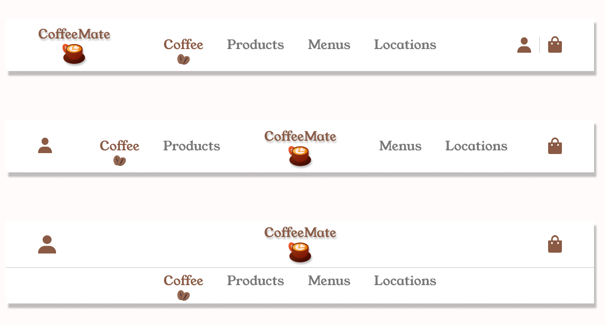
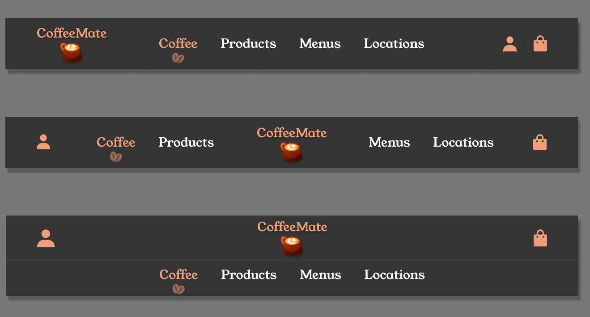
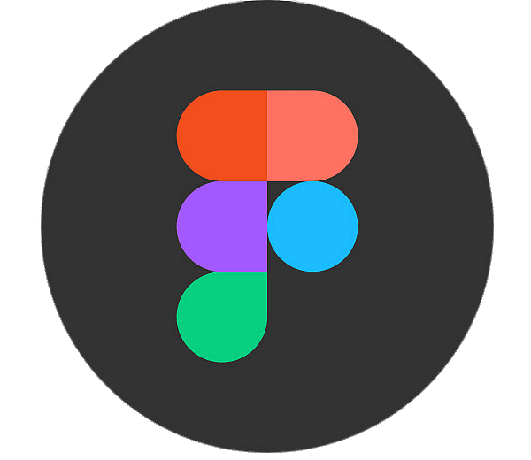

# Coffee Navbar 
## Introduction
The following project contains three different examples of navbars for a coffee shop.
## Features
* Dark and Light mode
* Responsive design
* HTML, CSS, JavaScript

## Design

## Resources
You can find more about this project here
*  [Dribbble]("https://dribbble.com/shots/22839780-Coffee-Shop-Nav-Bar-Design?utm_source=Clipboard_Shot&utm_campaign=coderb01&utm_content=Coffee%20Shop%20Nav%20Bar%20Design&utm_medium=Social_Share&utm_source=Clipboard_Shot&utm_campaign=coderb01&utm_content=Coffee%20Shop%20Nav%20Bar%20Design&utm_medium=Social_Share")
*  [Figma Design]("https://www.figma.com/community/file/1296000645745514069/coffe-navbar-design")
